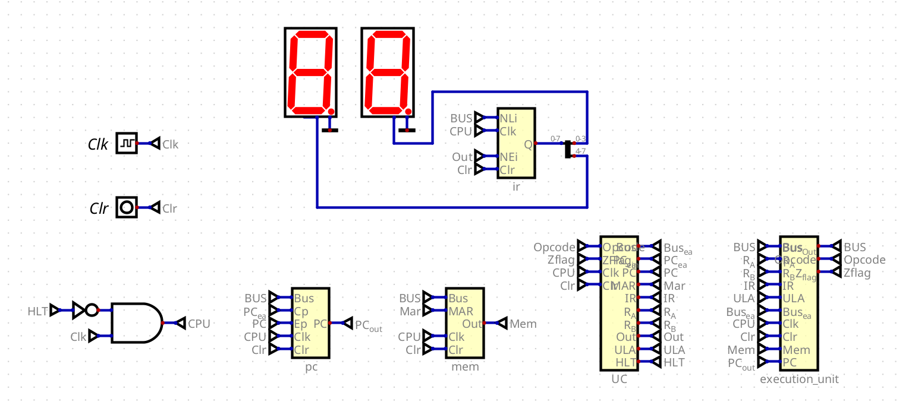
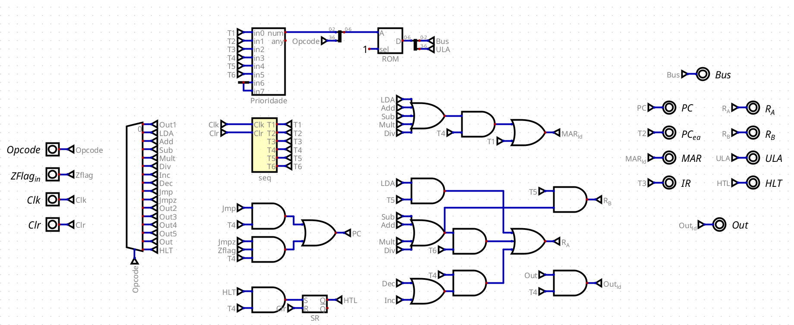
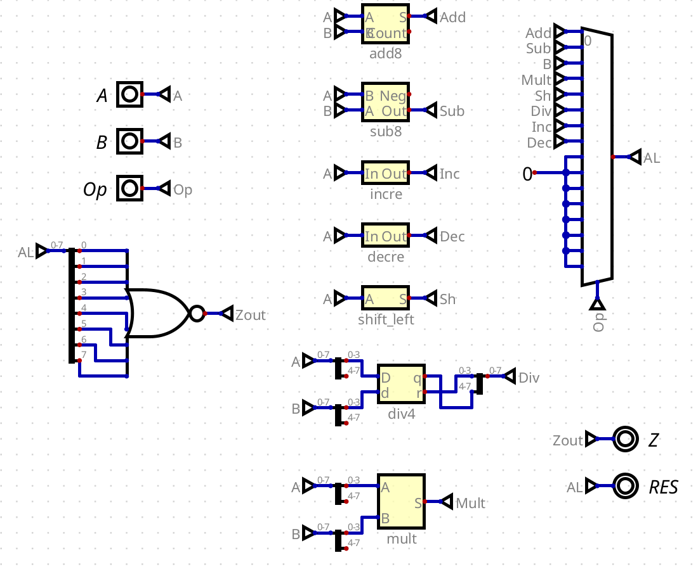
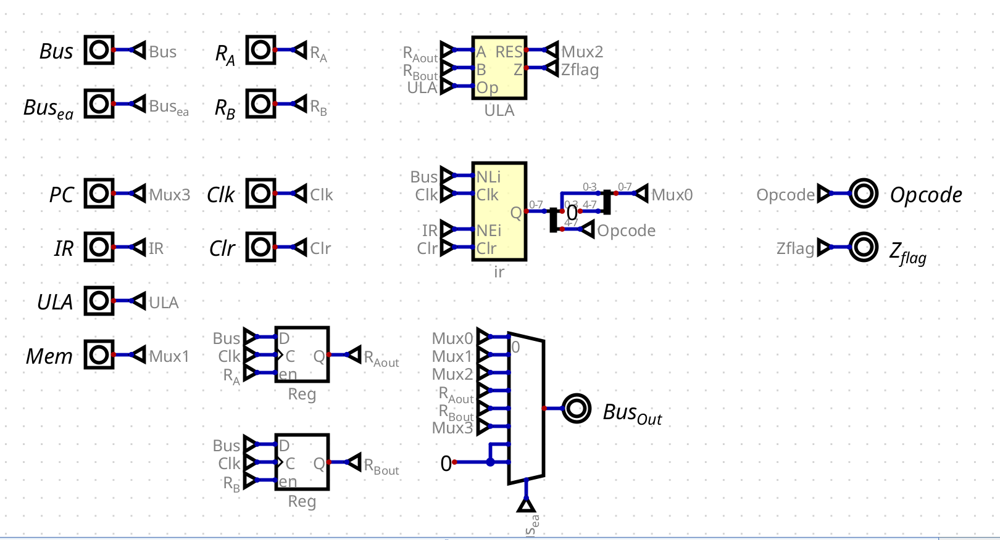

# CPU de 8-bits

Este projeto documenta o design e a implementação de uma CPU de 8-bits funcional utilizando o software [Digital](https://github.com/hneemann/Digital).

O objetivo principal foi criar uma arquitetura de computador simples, baseada no modelo de Acumulador, capaz de executar um conjunto de instruções aritméticas, lógicas e de controle de fluxo, demonstrando na prática os conceitos fundamentais de um processador.

## 1. Arquitetura Geral

A CPU segue uma arquitetura SAP-2, de Albert Paul Malvino, com um barramento de dados (W-Bus) de 8 bits que conecta as principais unidades funcionais. Todos os componentes operam de forma síncrona, controlados por um sinal de clock unificado.

As principais unidades que compõem o sistema são:
*   **Unidade de Controle (UC):** O cérebro da CPU, responsável por orquestrar todas as operações.
*   **Datapath:** O caminho de dados, onde as operações são efetivamente realizadas. Inclui a ULA, os registradores e a memória.
*   **Memória Principal (RAM/ROM):** Armazena o programa e os dados.
*   **Barramento (W-Bus):** A via de comunicação de 8 bits que interliga todos os componentes.

---

## 2. Componentes do Datapath

O Datapath é o conjunto de componentes que processa e armazena os dados.

### a. Registradores

*   **Program Counter (PC):** Um registrador de 8 bits que armazena o endereço da próxima instrução a ser buscada na memória. Possui lógica para incremento (`PC++`) e carga (`load`) a partir do barramento, essencial para a execução sequencial e para as instruções de salto (`JMP`).
*   **Memory Address Register (MAR):** Um registrador de 8 bits que armazena o endereço da memória a ser acessada (seja para leitura ou escrita). Ele recebe o endereço do PC (durante o Fetch) ou do IR (durante o Execute) através do barramento.
*   **Instruction Register (IR):** Um registrador de 8 bits que armazena a instrução atualmente em execução. Sua saída é dividida: os 4 bits superiores (Opcode) são enviados para a Unidade de Controle, e os 4 bits inferiores (Operando) são colocados no barramento quando necessário.

### c. Memória Principal (ROM)

Para este projeto, uma ROM de 256x8 bits é utilizada para simular a memória principal. Ela armazena tanto as instruções do programa quanto os dados que ele manipula. Ser assíncrona é uma característica chave, pois permite que os dados estejam disponíveis na saída assim que o endereço é estabilizado pelo MAR.

---

## 3. Unidade de Controle (UC)

A Unidade de Controle é o componente mais complexo e foi implementada usando uma arquitetura de microcódigo baseada em ROM. Ela é responsável por gerar os 18 sinais de controle que ditam o comportamento de todo o sistema a cada ciclo de clock.

### a. Sequenciador de T-States

O coração da UC é um contador binário de 4 bits que gera os T-States (T0 a T15). Ele avança a cada pulso de clock e é resetado para T0 por um sinal `RESET_T`, permitindo que as instruções tenham um número variável de ciclos para serem executadas, otimizando a performance.

### b. ROM de Controle

Uma ROM de 256x18 bits armazena a "lógica" da CPU. Seu endereço de 8 bits é formado pela combinação do T-State atual (4 bits) e do Opcode da instrução (4 bits). A cada combinação, ela retorna uma palavra de controle de 18 bits, onde cada bit corresponde a um sinal de controle específico (`PC_out`, `MAR_in`, `ALU_Sel`, etc.).

### c. Ciclo de Instrução

A UC implementa um ciclo de instrução de duas fases:

1.  **Ciclo de Busca (Fetch):** Uma sequência fixa de 3 T-States (T0, T1, T2) que busca a próxima instrução da memória e a carrega no Instruction Register.
    *   **T0:** `PC -> MAR`
    *   **T1:** `PC++`
    *   **T2:** `RAM -> IR`

2.  **Ciclo de Execução (Execute):** A partir do T3, a UC executa uma sequência de micro-operações específicas para a instrução decodificada. O número de passos varia conforme a complexidade da instrução, terminando sempre com a ativação do sinal `RESET_T`.

---

## 4. Unidade de execução

### a. ULA (Unidade Lógica e Aritmética)

A ULA é um circuito combinacional que recebe dois operandos de 8 bits (diretamente do Acumulador e do Registrador B) e, com base em um código de seleção de 3 bits vindo da Unidade de Controle, executa as seguintes operações:
*   Soma
*   Subtração
*   Multiplicação
*   Divisão
*   Incremento
*   Decremento

A ULA também gera uma **Zero Flag (ZFlag)**, que é ativada quando o resultado de uma operação é zero, sendo fundamental para a instrução de salto condicional (`JMPZ`).

### b. Registradores de Dados

*   **Acumulador (Registrador A):** O principal registrador de trabalho da CPU. É um dos operandos padrão para a ULA e é onde o resultado da maioria das operações aritméticas é armazenado.
*   **Registrador B:** Um registrador de 8 bits usado para armazenar temporariamente o segundo operando em operações aritméticas de dois operandos (como `ADD` e `SUB`).
*   **Registrador de Saída (OUT):** Um registrador de 8 bits cuja saída está conectada a dois displays de 7 segmentos. Ele armazena o valor a ser exibido, atualizado pela instrução `OUT`.

## 5. Conjunto de Instruções (ISA)

A CPU utiliza um formato de instrução de 8 bits, dividido em 4 bits para o Opcode e 4 bits para o Operando (endereçamento direto).

| Instrução | Opcode | Função                                     |
|-----------|--------|--------------------------------------------|
| `NOP`     | 0x0    | Nenhuma operação.                          |
| `LDA`     | 0x1    | Carrega dado da memória em A.              |
| `ADD`     | 0x2    | Soma A com dado da memória.                |
| `SUB`     | 0x3    | Subtrai dado da memória de A.              |
| `MULT`    | 0x4    | Multiplica A por dado da memória.          |
| `DIV`     | 0x5    | Divide A por dado da memória.              |
| `INC`     | 0x6    | Incrementa A.                              |
| `DEC`     | 0x7    | Decrementa A.                              |
| `JMP`     | 0x8    | Salta para um endereço.                    |
| `JMPZ`    | 0x9    | Salta para um endereço se a Zero Flag for 1.|
| `OUT`     | 0xC    | Envia o valor de A para o display.         |
| `HLT`     | 0xF    | Para a execução.                           |

---
## 6. Demonstração

Segue abaixo um link do vídeo explicando com mais detalhes o funcionamento da CPU, bem como exemplos de programas simples que podem ser executados nela.

[Link do vídeo](https://drive.google.com/drive/folders/14tZaXBvS7zAQLFGPerRbzpO2WhnC94yK?usp=sharing)
